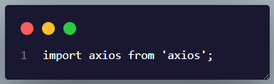
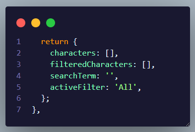
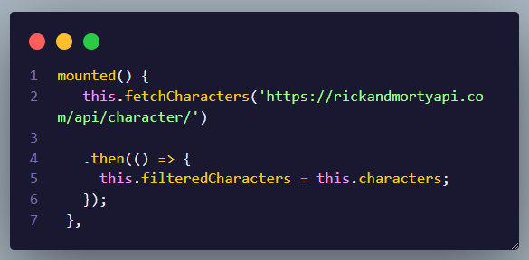
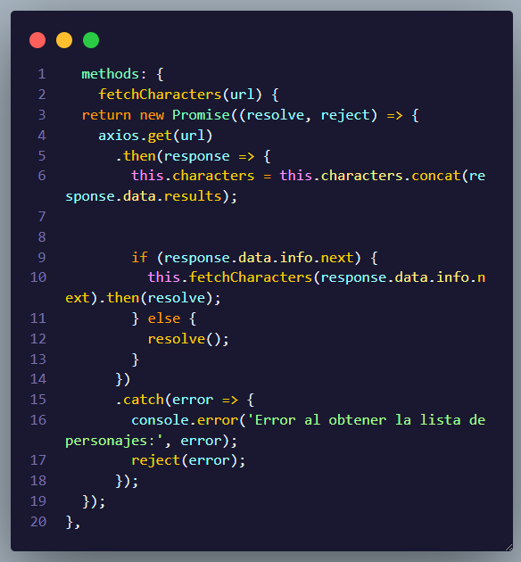
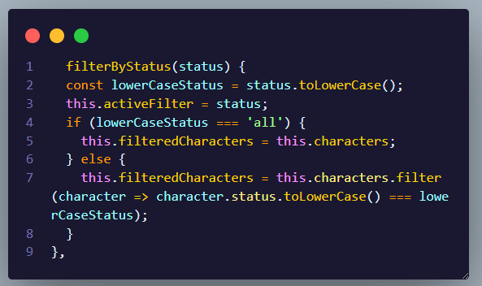
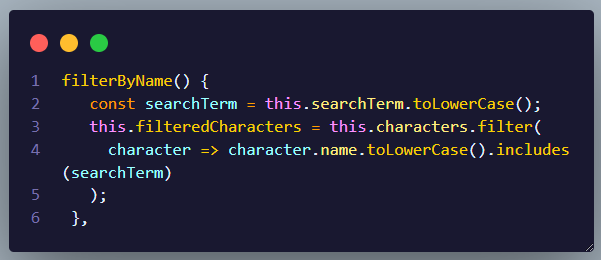

# API-RickAnMorty

This is a Vue.js component that displays a list of Rick and Morty characters, allowing you to filter them by status and search by name.


## Here I explain each part:

## 1. axios import:


Here we import axios, a library for making HTTP requests from the browser.

## 2. Definition of component data:


Here you define the data properties of the component:

* characters: Stores all characters obtained from the API.
* filteredCharacters: Stores the characters that match the applied filters.
* searchTerm: Stores the search term entered by the user.
* activeFilter: Stores the state of the active filter.

## 3. mounted method:


This method is executed when the component has been mounted to the DOM. Here the fetchCharacters method is called to get the characters from the API. Once all characters have been obtained, characters are assigned to filteredCharacters to display all characters initially.

## 4. fetchCharacters method:


This method makes a GET request to the provided URL, which is the Rick and Morty API. Concatenates the response results to characters. If there is a next page of results, it makes a recursive request to that page. Returns a promise that resolves when all characters have been obtained.

## 5. filterByStatus method:


This method filters characters by status. If the status is 'all', it shows all characters. Otherwise, it shows only characters whose status matches the filter. It also updates activeFilter to reflect the active filter.

## 5. filterByName method:


This method filters characters by name. Shows only characters whose name includes the search term.


## 7. Component Template: 
The component template displays a list of characters. Each character is shown on a card with their image, name, status, species, gender, origin and location. There is also a search bar and buttons to filter by status. When a filter button is clicked, the filterByStatus method is called with the corresponding status. When text is entered into the search bar, the filterByName method is called.


## Customize configuration

See [Vite Configuration Reference](https://vitejs.dev/config/).

## Project Setup

```sh
npm install
```

### Compile and Hot-Reload for Development

```sh
npm run dev
```

### Compile and Minify for Production

```sh
npm run build
```
